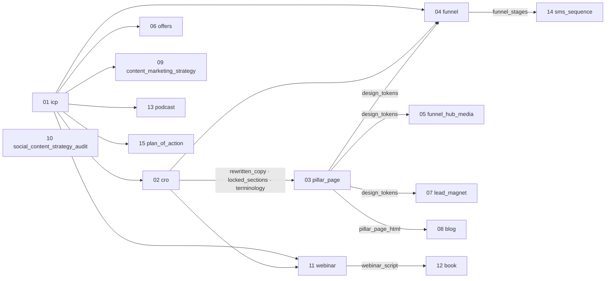

# Asset Dependency Map — what each asset needs before it can run

**Purpose.** To answer one question per asset: *if I run this on its own, what do I have to hand it,
and what can I ignore?*

**Derived from code, not from prose.** Every dependency below was extracted from
`application/backend/schemas/drafts/*.json` (the field registry — `source: "auto_from_context"`,
`context_key`, `sub_key`, `required`, `fallback`) cross-referenced with `writesContextKeys` in
`application/frontend/src/data/assetCatalog.ts`. Where this document disagrees with those files,
they are right and this is stale. `DAG_SOURCE_MAP.md` in the schemas folder maps asset ids to prompt
files; this is the input/output layer on top of it.

---

## 1. How an asset gets its inputs today

Each field on an asset resolves from exactly one of four places, decided by `planField` in
`application/frontend/src/lib/fieldResolution.ts`:

| Source | How it fills | Where it comes from |
| --- | --- | --- |
| **Typed answer** | the operator is asked | intake |
| **Client-profile fact** | auto-filled, silently, no question | `CLIENT_PROFILE_SOURCES` — 19 field ids collapse onto 5 facts: `client_name`, `website_url`, `region`, `industry`, `target_service` |
| **Context store** | auto-filled from an upstream asset's approved output | `context_key` → the asset whose `writesContextKeys` contains it |
| **Competitor prepass** | auto-runs inside the stage, does its own web search | `pairedCompetitorAssetId` |

**What happens on a miss** is the field's `fallback`, and this is the mechanism that makes standalone
runs possible at all:

- `ask_user_if_missing` — the field becomes a normal question. **You can paste the upstream
  document by hand.** This is the fallback on **64 of the 65** `auto_from_context` fields in the
  pipeline, and it is what makes a standalone run possible without any code change.
- `skip_silently_if_missing` / `treat_as_empty_if_missing` — the field is left empty and the
  prompt degrades on its own. Exactly one field uses it: `sms_sequence.email_sequence_copy`.
- `overridable: true` — the field *stops and offers a choice* even when it resolves: accept the
  upstream output or supply a different one (`ContextChoiceCard`).

**Two further behaviours worth knowing:**

- **Inheritance down the run chain.** `_latest_context_entry` (`app/routers/pipeline.py`) walks up to
  `_MAX_SOURCE_RUN_HOPS = 4` parent runs via `source_run_id`. This is what Phase 2 is built on — a
  sub-service run reads its parent's ICP, CRO rewrite and pillar page rather than re-deriving them.
  Two keys are excluded and stop at the run that wrote them: `keyword_clusters` and
  `selected_headlines` (`PHASE_SCOPED_CONTEXT_KEYS`).
- **Sub-key extraction.** Three `pillar_page` fields and three `offers` fields do not read a whole
  document; they pull one value out of the CRO rewrite's terminology row (`extractSubKey` in
  `lib/contextSubKeys.ts`). If that row is not found, the field falls through to being asked.

---

## 2. What each asset writes

An asset's own output is stored under `context_key = asset_id`. These are the *additional* keys
declared in `writesContextKeys`, and they are what downstream assets actually read.

| Asset | Writes |
| --- | --- |
| `icp` | `icp` |
| `cro` | `cro_audit_findings`, `cro_rewritten_copy`, `cro_locked_sections`, `cro_terminology_map` |
| `pillar_page` | `pillar_page_html`, `design_tokens`, `seo_pillar_page_copy` |
| `funnel` | `funnel_stages` |
| `funnel_hub_media` | `funnel_hub_media` |
| `offers` | `offer_ladder` |
| `lead_magnet` | `lead_magnet` |
| `blog` | `blog` |
| `content_marketing_strategy` | `content_marketing_strategy` |
| `social_content_strategy_audit` | `social_content_strategy_audit` |
| `webinar` | `webinar_script` |
| `book` | `book` |
| `podcast` | `podcast` |
| `sms_sequence` | `sms_sequence` |
| `plan_of_action` | `plan_of_action_summary` |
| each `competitor_analysis_*` | its own `asset_id` |

---

## 3. The dependency table

`REQ` = required field, run is blocked until it is provided or pasted.
`opt` = optional, safe to leave empty.
`auto` = the paired competitor prepass, which runs itself and needs no upstream asset.

The `Requires` and `Optional` columns list **upstream assets only**. A field that is required
but satisfied by the prepass (`social_content_strategy_audit.competitor_list`,
`lead_magnet.competitor_lead_magnet_list`, `content_marketing_strategy.competitor_list`) is
shown as `auto`, not as a requirement — there is no asset you have to run first for it.

| # | Asset | Requires | Optional | Prepass |
| --- | --- | --- | --- | --- |
| 01 | `icp` | — | — | — |
| 02 | `cro` | `icp` | — | `auto` |
| 03 | `pillar_page` | `cro_rewritten_copy`, `cro_locked_sections`, `cro_terminology_map` ×3 sub-keys | — | `auto` |
| 04 | `funnel` | `icp`, `cro_rewritten_copy`, `cro_locked_sections`, `design_tokens` | — | — |
| 05 | `funnel_hub_media` | `design_tokens`, *reference folder* (always asked) | `icp`, `funnel_stages` | — |
| 06 | `offers` | `icp` | `cro_rewritten_copy`, `cro_terminology_map` ×3 | `auto` |
| 07 | `lead_magnet` | `icp`, `design_tokens` | `cro_rewritten_copy`, `pillar_page_html`, `funnel_stages`, `offer_ladder` | `auto` |
| 08 | `blog` | `icp`, `cro_rewritten_copy`, `pillar_page_html` | — | `auto` |
| 09 | `content_marketing_strategy` | `icp` | `cro_rewritten_copy`, *existing content* (always asked) | `auto` |
| 10 | `social_content_strategy_audit` | — | `icp`, *service list* (always asked) | `auto` |
| 11 | `webinar` | `icp`, `cro_rewritten_copy` | `design_tokens` | `auto` |
| 12 | `book` | `icp`, `webinar_script` | `cro_rewritten_copy`, `content_marketing_strategy`, `plan_of_action_summary` | `auto` |
| 13 | `podcast` | `icp`, `cro_rewritten_copy` | `pillar_page_html`, `webinar_script` | `auto` |
| 14 | `sms_sequence` | `icp`, `cro_rewritten_copy`, `funnel_stages` | `offer_ladder`, `email_sequence_copy` | — |
| 15 | `plan_of_action` | `icp` | `cro_rewritten_copy`, `funnel_stages`, `offer_ladder`, `design_tokens` | — |

### Read the other way — who depends on each output

| Output | Required by | Optional for |
| --- | --- | --- |
| `icp` | 11 assets | `funnel_hub_media`, `social_content_strategy_audit` — absent entirely only from `pillar_page` |
| `cro_rewritten_copy` | `pillar_page`, `funnel`, `blog`, `webinar`, `podcast`, `sms_sequence` | `offers`, `lead_magnet`, `content_marketing_strategy`, `book`, `plan_of_action` |
| `design_tokens` (from `pillar_page`) | `funnel`, `funnel_hub_media`, `lead_magnet` | `webinar`, `plan_of_action` |
| `cro_locked_sections` | `pillar_page`, `funnel` | — |
| `cro_terminology_map` | `pillar_page` (×3) | `offers` (×3) |
| `pillar_page_html` | `blog` | `lead_magnet`, `podcast` |
| `funnel_stages` | `sms_sequence` | `funnel_hub_media`, `lead_magnet`, `plan_of_action` |
| `webinar_script` | `book` | `podcast` |
| `offer_ladder` | **nothing** | `lead_magnet`, `sms_sequence`, `plan_of_action` |
| `content_marketing_strategy` | — | `book` |
| `plan_of_action_summary` | — | `book` |
| `cro_audit_findings`, `seo_pillar_page_copy`, `funnel_hub_media`, `lead_magnet`, `blog`, `social_content_strategy_audit`, `podcast`, `sms_sequence`, `book` | **nothing** | — |

---

## 4. The real critical path

Only **four** assets are ever a hard prerequisite for another. Everything else is a leaf.



**Four tiers:**

1. **`icp`** — the only true root. Required by 11 of 15.
2. **`cro`** — the spine. Its rewrite feeds 6 assets as a requirement and 5 more optionally.
3. **`pillar_page`** — the design source. `design_tokens` is the thing three assets cannot do without.
4. **`funnel` / `webinar`** — each blocks exactly one downstream asset (`sms_sequence`, `book`).

**Nothing else blocks anything.** `offers`, `lead_magnet`, `blog`,
`content_marketing_strategy`, `social_content_strategy_audit`, `podcast`, `sms_sequence`,
`funnel_hub_media`, `book` and `plan_of_action` are all terminal — their output is consumed only
optionally, or not at all.

---

## 5. Running one asset standalone

**The transitive column is the answer to your question.** It is what you would have to run *if you
paste nothing*. Every requirement can instead be pasted by hand, because every context field in the
pipeline falls back to `ask_user_if_missing`.

| Want to run | Must supply (paste or inherit) | If you paste nothing, you must first run | Cheapest path |
| --- | --- | --- | --- |
| `icp` | — | — | 1 stage |
| `cro` | ICP | `icp` | 2 |
| `pillar_page` | CRO rewrite + locked sections + terminology | `cro` (and `icp` for it) | 3 |
| `funnel` | ICP + CRO rewrite + locked sections + design tokens | `icp`, `cro`, `pillar_page` | 4 |
| `funnel_hub_media` | design tokens + reference folder | `icp`, `cro`, `pillar_page` | 4 |
| **`offers`** | **ICP only** | **`icp`** | **2** |
| `lead_magnet` | ICP + design tokens | `icp`, `cro`, `pillar_page` | 4 |
| `blog` | ICP + CRO rewrite + pillar page HTML | `icp`, `cro`, `pillar_page` | 4 |
| `content_marketing_strategy` | ICP | `icp` | 2 |
| `social_content_strategy_audit` | **nothing** | — | 1 |
| `webinar` | ICP + CRO rewrite | `icp`, `cro` | 3 |
| `book` | ICP + webinar script | `icp`, `cro`, `webinar` | 4 |
| `podcast` | ICP + CRO rewrite | `icp`, `cro` | 3 |
| `sms_sequence` | ICP + CRO rewrite + funnel stages | `icp`, `cro`, `pillar_page`, `funnel` | 5 |
| `plan_of_action` | ICP | `icp` | 2 |

### Your example, answered

**Offer Ladder (`offers`) needs the ICP and nothing else.** Stages 02–05 are entirely skippable.
From `offers_v2.json`:

```
REQUIRED  icp_document                       <- icp_*
optional  cro_messaging_framework            <- cro_rewritten_copy
optional  competitor_analysis                <- competitor_analysis_offers   (auto prepass)
optional  word_for_the_buyer                 <- cro_terminology_map.word_for_the_reader
optional  word_for_the_offer_unit            <- cro_terminology_map.word_for_the_thing_being_chosen_between
optional  word_for_the_first_commitment_step <- cro_terminology_map.word_for_the_first_commitment_step
```

So: run `icp`, then jump straight to `offers`. The three terminology words degrade to being asked
(or defaulted by the prompt), and the competitor benchmark runs itself. **What you lose** by
skipping CRO is voice consistency — the ladder will not share the page's locked terminology unless
you supply those three words.

### The cheapest useful sets

- **`social_content_strategy_audit` alone** — one stage, zero upstream. Its only real input is the
  competitor list, which the prepass produces itself.
- **`icp` → `offers`** or **`icp` → `plan_of_action`** — two stages.
- **`icp` → `cro` → `webinar` → `book`** — the long-form branch, four stages, no pillar page needed.
- **`icp` → `cro` → `pillar_page`** unlocks the widest set at once: `funnel`, `funnel_hub_media`,
  `lead_magnet` and `blog` all become runnable.

---

## 6. What already works, and what does not

### Works today

- **Pasting an upstream document.** Every context field falls back to `ask_user_if_missing`, so a
  missing dependency becomes a question you can answer by pasting. This is the existing standalone
  path, and it needs no code change.
- **Reuse within a chat session.** `resolveContext` reads the session's context store, so an asset
  run later in the same chat picks up whatever is already approved — which is the "take it if it
  already exists" half of what you described.
- **Reuse across runs.** `source_run_id` inheritance walks up to 4 parent runs, so a new run linked
  to an existing one reads its ICP, CRO rewrite and pillar page without re-deriving them. This is
  how Phase 2 already works.
- **Explicit override, on two fields.** `overridable: true` makes a field stop and offer
  accept-or-replace even when the upstream output exists. It is a frontend annotation
  (`data/assetCatalog.ts`, absent from the backend schemas) and today it is set on exactly two:
  `cro.icp_document` and `cro.competitor_analysis` — the two an operator is most likely to hold
  a better version of. Every other context field fills in silently.

### Does not work today

> **Superseded.** Everything in this list has since been built — see section 8. It is kept as
> written because it is the case the design answers, and because the "smallest change" below is
> what was actually implemented.

- **Starting a run at an arbitrary stage.** `currentIndex` advances sequentially and the UI walks
  the stage list in order. There is no "jump to stage N" entry point — reaching `offers` means
  passing through 02–05, even if you skip their questions.
- **Seeding context without running the producer.** There is no route that writes a `ContextEntry`
  for, say, `cro_rewritten_copy` from a document you supply. Pasting into a *field* works and is
  per-asset; it does not populate the key for the next asset that wants it. Run `offers` and then
  `lead_magnet` and you will paste the same CRO rewrite twice.
- **Seeing what a stage will ask before you commit.** The dependency set is only discoverable by
  starting the stage.

### The smallest change that would give you what you want

One route — `POST /pipeline/runs/{run_id}/context` taking `{context_key, content}` and writing a
`ContextEntry` exactly as stage approval does — plus a "start at stage N" entry point. With those
two, the flow becomes: create a run, seed `icp` (and anything else you have), jump to `offers`. Every
resolution mechanism downstream of that already exists and would pick the seeded keys up unchanged.

---

## 7. Findings worth noting

1. **`pillar_page` never reads the ICP.** Of the fourteen assets after `icp`, it is the *only*
   one with no ICP field at all — every other asset has one, required in eleven and optional in
   `funnel_hub_media` and `social_content_strategy_audit`. `pillar_page` inherits the audience
   indirectly, through the CRO rewrite. Worth knowing before running it standalone: its output
   is only as audience-aware as the copy you hand it.
2. **`offer_ladder` is required by nothing.** `offers` is a leaf. Three assets read it optionally.
   Running it early buys nothing downstream; running it late costs nothing.
3. **`email_sequence_copy` has no producer.** `sms_sequence` reads it, and no asset in the catalog
   writes it. Its fallback is `skip_silently_if_missing`, so this degrades cleanly rather than
   breaking — but the field can only ever be filled by hand today.
4. **Three fields are permanently manual.** `funnel_hub_media.reference_folder_knowledge_base`,
   `content_marketing_strategy.existing_content_assets_optional` and
   `social_content_strategy_audit.client_s_own_service_offering_list` all carry
   `context_key: "unresolved_context_key"`, which `resolveContext` returns nothing for by design.
   They are always asked, in every run, whatever else exists.
5. **The competitor prepasses are not dependencies.** All ten do their own web search and are
   declared `optional` in every consuming schema except `lead_magnet.competitor_lead_magnet_list`
   and `content_marketing_strategy.competitor_list`. They never require an upstream asset.
6. **`funnel` is the most expensive asset to reach** — four upstream stages — and it blocks only
   `sms_sequence`.
7. **The catalog order is not the dependency order.** `funnel` (04) requires `design_tokens` from
   `pillar_page` (03) and `funnel_hub_media` (05) requires the same, but `offers` (06) requires
   neither. The sequence is a sensible default build order, not a constraint graph.

---

## 8. What was built from this report

Section 6 ends with "the smallest change that would give you what you want". That change is now in,
as one service and two routes. Nothing here re-derives the graph: `app/services/dependencies.py`
reads the same `schemas/drafts/*.json` this report was compiled from, so the table in section 3 and
the answers the API gives cannot disagree.

### The graph, server-side — `app/services/dependencies.py`

| Function | Answers |
| --- | --- |
| `dependencies_for(asset_id, phase)` | every upstream document the stage reads, with the phase's field deltas already applied |
| `producer_of(context_key)` | which asset writes that key, or `None` for the four keys nothing does |
| `transitive_producers(asset_id)` | the chain that would have to run if nothing were supplied — the "cheapest path" column, computed |
| `seedable_keys()` | the twelve keys a caller may supply by hand |
| `prepass_for(asset_id)` | the stage's own competitor scan, which is **not** a dependency |

Two tables in it are hand-maintained, because the server had no copy of them: `WRITES` (section 2)
and `PREPASS`. `tests/test_dependencies.py` parses `assetCatalog.ts` and asserts both match it,
which is the only reason a second copy is acceptable.

`AssetDependencies.prepass_fields` is reported separately from `.dependencies` for the reason
finding #5 gives. `lead_magnet.competitor_lead_magnet_list` is `required` and nothing upstream
writes it; listed as a dependency, it would report that stage as permanently unstartable and send
an operator looking for a stage that does not exist.

### `POST /pipeline/runs/{run_id}/context`

`{context_key, content, note?}`. Writes a `ContextEntry` exactly as stage approval does — same
table, same key, same version sequence — so every reader downstream needs no special case.

- `written_by_asset_id` is left **null**. Pointing it at the producing asset would claim `icp` wrote
  a document `icp` never saw, corrupting the one column that records where output came from.
- The stored value carries `"seeded": true`, which is what the UI labels "a document you supplied".
- A key outside `seedable_keys()` is a **422 listing the valid keys**. A mistyped key would be
  accepted silently by the database, and the operator's evidence that they had supplied the
  dependency would be the stage carrying on asking for it.
- It locks nothing out. Running the real stage later appends a higher version and wins, because
  "latest" is `ORDER BY version DESC`.

### `GET /pipeline/runs/{run_id}/readiness/{asset_id}?phase=`

Free and read-only. Per dependency: `ready`, `source` (`this_run` | `inherited`), `from_run_id`,
`seeded`, `version`, `chars`, `producer`, and `stored_under`. Plus `blocked`, `run_first`,
`seedable`, `writes`, and `prepass`/`prepass_fields` apart from the dependency list.

Two things in it are worth knowing before relying on the numbers:

- **A document is looked for under two keys.** `save_stage` files output under `asset_id` and
  nothing else, so the four extra keys `cro` publishes have no rows of their own. Probing only
  `cro_rewritten_copy` finds nothing on a run whose CRO stage was approved — the one wrong answer
  that would make the route worse than nothing, because the operator would go and re-run a stage
  they had already run. So the context key is tried first (where a supplied document lands) and the
  producing asset's id second (where an approved stage lands).
- **`run_first` is computed against the run, not read off the graph.** A branch stops the moment the
  run already holds the document. Seeding `funnel_stages` drops not just `funnel` from
  `sms_sequence`'s chain but `pillar_page` and `cro` behind it, which were only there to reach it —
  four stages to none.

`unresolved_context_key` fields (finding #4) are returned with `manual: true` and excluded from
`blocked`. They are questions the stage asks every time; counted as missing documents,
`funnel_hub_media` would report as permanently blocked with nothing an operator could do about it.

### The entry point

"Start here" on any queued stage in the Asset Pipeline pane (`PipelineDiagram`), which calls
`startAtStage` and pushes a `stage-gate` card rather than entering the stage. Per document the card
offers exactly the three options this report identified — use what the run has, paste your own, or
run the one asset that produces it — and states which of the three are even possible, since a key
with no producer (`email_sequence_copy`) can only be pasted.

The competitor scan is shown as a step and never as an offer, and the card says whether entering
will spend a search or reuse a listing the run already has. `enterGatedStage` hydrates a stored
prepass into the session before entering for exactly that reason: the decision to re-search is
made from the *session* context, which a reopened chat does not have, so without it a resumed run
would pay for a listing already in the store.

Coverage: `tests/test_dependencies.py` (42 checks, the graph and the drift tests),
`tests/test_standalone_runs.py` (27, both routes against a faked session) and
`frontend/smoke/gate.tsx` (34 render checks, the card's offers).
