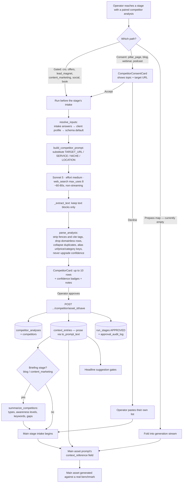

# Competitor Analysis — How It Works

How the ten `competitor_analysis_*` stages find competitors, what each one actually compares them
on, how the result is verified, parsed, reviewed, stored, and how it reaches the fifteen main
assets in the pipeline.

Everything below is drawn from the code as it stands:

| Concern | Where it lives |
| --- | --- |
| Prompts (the comparison criteria) | `application/backend/assets/Prompts/Competitor Analysis/01..10_*.md` |
| Phase-2 prompts | `application/backend/assets/Prompts/Phase2/competitors_phase2/*.md` |
| Stage wiring, fetch, parse, render | `application/backend/app/services/competitor.py` |
| Input schemas / defaults | `application/backend/schemas/drafts/competitor_analysis_*.json` |
| HTTP routes + prepass | `application/backend/app/routers/pipeline.py` |
| Storage | `application/backend/app/db/models.py` (`CompetitorAnalysis`, `Competitor`) |
| Operator briefing | `application/backend/app/services/insights.py` |
| UI orchestration | `application/frontend/src/pipeline/pipelineStore.ts`, `pipelineData.ts` |
| UI cards | `application/frontend/src/pipeline/CompetitorCard.tsx`, `CompetitorConsentCard.tsx` |
| Dependency map | `application/backend/schemas/drafts/DAG_SOURCE_MAP.md`, `app/db/seed.py` |

---

## 1. The idea in one paragraph

A competitor analysis here is **not** a general "who are our rivals" report. Each of the ten
analyses asks a different, narrow question tied to the one asset it feeds: *who in this market has
actually built the thing we are about to build, and what does theirs look like?* The CRO analysis
looks only for companies with a real CRO offering; the Offers analysis looks only for companies with
published pricing; the Podcast analysis looks only for companies running their own show. A
competitor that qualifies for one analysis routinely fails another, and that is by design — the
qualifying artefact **is** the comparison basis.

Each stage returns **up to 10** verified competitors plus a prose `notes` section explaining any
shortfall. That listing is reviewed by a human, persisted relationally, rendered to prose, and
spliced into the paired main asset's prompt as its competitive benchmark.

---

## 2. The ten analyses at a glance

Every row is one stage. "Qualifying artefact" is the thing that must exist and be confirmed on the
competitor's own page for them to be included at all.

| # | Stage `asset_id` | Feeds main asset | Qualifying artefact (the basis of comparison) | URL captured | Extra classifier | Highest-weighted score factor |
|---|---|---|---|---|---|---|
| 1 | `competitor_analysis_cro` | `cro` | Genuine CRO offering: dedicated CRO page, described process (audits, A/B testing, funnel analysis), or case studies with conversion-lift numbers | `cro_page_url` | — | Service match (CRO specifically) |
| 2 | `competitor_analysis_offers` | `offers` | Published, comparable **offer**: pricing/packages page with visible tiers, a stated starting price, or itemised inclusions | `offer_page_url` | — (carries `starting_price`) | Offer clarity/strength |
| 3 | `competitor_analysis_lead_magnet` | `lead_magnet` | A distinct **gated asset**: ebook, checklist, template, white paper, quantified free audit, or free workshop used top-of-funnel | `lead_magnet_url` | `lead_magnet_type` | Lead-magnet strength/specificity |
| 4 | `competitor_analysis_blog` | `blog` | An actively-maintained **blog / content hub** with real depth on the topic — not one orphan article | `blog_url` | `content_focus` | Blog depth on the target topic |
| 5 | `competitor_analysis_seo_pillar_page` | `pillar_page` | A true **cornerstone pillar page**: own URL, ToC/jump nav, multiple structured H2s, 1,500+ words, internal links to cluster content | `pillar_page_url` | — | Pillar-page structural quality |
| 6 | `competitor_analysis_content_marketing` | `content_marketing_strategy` | Content marketing as a **distinct discipline explicitly feeding** the target service — not two unconnected line items | `content_marketing_page_url` | — | Explicitness of the content→service pipeline |
| 7 | `competitor_analysis_social_content_strategy` | `social_content_strategy_audit` | A **strategy-to-execution** pipeline: pillars/calendar planning **and** actual post creation (copy, design, video), ideally scheduling | `service_page_url` | — | Concreteness of the strategy→post pipeline |
| 8 | `competitor_analysis_webinars` | `webinar` | A **self-hosted, company-branded** webinar programme (live and/or on-demand) used as a lead magnet | `webinar_page_url` | — | Confirmed ownership of the programme |
| 9 | `competitor_analysis_book` | `book` | A genuinely **published, full-length book** (retail listing) authored by the founder/company on the topic | `book_page_url` | — | Directness of book↔service topical match |
| 10 | `competitor_analysis_podcast` | `podcast` | An **ongoing, self-hosted, company-branded podcast**, by a company still actively selling the service | `podcast_page_url` | `topical_focus` | Confirmed company ownership of the show |

The five main assets with no competitor analysis at all: `icp`, `funnel`, `funnel_hub_media`,
`sms_sequence`, `plan_of_action` (per `DAG_SOURCE_MAP.md`).

---

## 3. What every analysis has in common

These rules are repeated across all ten prompt files and are what make the ten outputs a single,
uniform contract the rest of the system can consume.

**Sizing — "up to 10", never padded.**
Every prompt says: *if fewer than 10 genuinely qualifying competitors can be found and verified,
return fewer rather than padding the list with weak or unverified matches.* A short list is a real
finding about the market, and the `notes` field exists to explain it.

**Verification confidence — three values, never upgraded.**
Each row carries `verification_confidence` ∈ `Verified` / `Partially verified` / `Unverified`,
reflecting whether the artefact was confirmed **by opening the page** rather than inferred from a
search snippet. The parser hard-codes this set and downgrades anything unrecognised to `Unverified`
(`_VALID_CONFIDENCE` in `competitor.py`) — it never silently promotes a value into `Verified`. The
UI colour-codes it (green / orange / grey) and never hides or averages it.

**Categorical exclusions.**
Directories, marketplaces, freelancer platforms, aggregators, and low-quality or inactive sites are
excluded everywhere. The point is a list of *genuine service providers*, because a directory entry
masquerading as a competitor would corrupt every downstream asset that reads the listing.

**Organic-visibility floor.**
Every prompt requires "strong organic visibility (ranking pages, consistent SEO presence)". This is
what keeps the set to competitors the client actually competes with for attention, not any company
that happens to own the artefact.

**Fetch-to-verify, not snippet-to-guess.**
Each file explicitly instructs verifying candidates by fetching the actual page. This is why the call
runs with a live web-search tool (§5) — without it, the model can only produce plausible-looking
domains from training memory, which would silently corrupt every downstream asset.

**Mandatory `notes`.**
Required even when 10 results come back. It must state how many were returned against 10, explain any
gap, and name near-misses and false positives *and why they were dropped*. Two stages go further:
`08_Webinars.md` demands a named reason per near-miss, and `10_Podcast.md` demands concrete next
steps for closing the gap (which platforms / adjacent niches to try).

**Strict JSON, no prose outside it.**
The response must be a bare JSON object `{"competitors": [...], "notes": "..."}`. Nothing about the
listing is meant to be read as free text — the UI renders the parsed rows.

**Shared scoring dimensions.**
`similarity_score` (0–1) always blends: the artefact-specific factor (highest weight, differs per
stage — see the table above), service match, niche match, business-model similarity, geographic
relevance, and organic-search competitive overlap. `avg_position` and `intersections` are optional
SEO-overlap metrics and are explicitly allowed to be `null` (in practice they usually are — see §12).

**Shared inputs.**
Four placeholders, identical across the ten files: `{TARGET_URL}` (required — the client site being
benchmarked), `{SERVICE}`, `{NICHE}`, `{LOCATION}`. Plus two inputs described inside the prompt body:
`competitor_type` (`niche_specialist` | `full_stack_niche`; both included when blank) and
`excluded_competitors` (a dedup list — see §12 for its current status). `01_CRO.md` and
`07_Social_Content_Strategy_and_Posts.md` hard-code their service and so carry no `{SERVICE}` token
at all. `location` defaults to `"Australia-wide"` on every stage via the schema default.

---

## 4. What each analysis actually compares — in detail

### 4.1 CRO (`01_CRO.md` → `cro`)

- **Qualifies:** a dedicated CRO service page, a described methodology (audits, A/B testing, landing
  page optimisation, funnel analysis), or case studies citing concrete conversion lift.
- **Disqualifies:** a page that mentions "conversion" in passing with no described process or
  evidence of delivery.
- **`service` is fixed** to `"conversion rate optimisation (CRO)"` by the stage's schema default —
  this analysis never searches on the client's own service.
- **Selection branches** on what is known: both service and niche → CRO providers inside that niche,
  generalists excluded; service only → strong CRO providers regardless of niche, ranked on SEO
  presence; service unclear → infer the target's service mix from the site and match business model
  (agency / specialist / consultancy / SaaS-adjacent).
- **`offering_summary` must describe** the service shape, the process they publish, and any concrete
  results — and must stand alone without opening the URL.
- **Contributes:** the CRO rewrite's page architecture is derived from this set, which is why it is a
  gated, human-reviewed step rather than an invisible prepass.

### 4.2 Offers (`02_Offers.md` → `offers`)

- **Qualifies:** a genuinely published offer — tiered packages, a stated starting price, or itemised
  deliverables.
- **Disqualifies / deprioritises:** "contact us for a quote" pages with no packaging signal;
  generalists with no offer structure.
- **`offer_page_url` must be the packages/pricing page** — not the homepage, not a generic service
  page — because it is the page a buyer would actually compare.
- **`starting_price` is captured verbatim** ("From $1,500/mo", "$990 setup + $2,400/mo") with its
  unit and "from" qualifier intact. Rules the prompt is explicit about: never estimate a price, never
  convert currencies, and **never do tax arithmetic** in either direction — a tax basis goes into
  `offering_summary` ("priced ex-GST") so a column of prices stays scannable and honest.
- **`offering_summary` must describe the shape of the offer**: number of tiers, what each costs, what
  is itemised, setup fees, contract minimums, priced add-ons.
- **Contributes:** the client's value ladder is priced against this column, which is why price gets
  its own pill in the UI and its own column in the database.

### 4.3 Lead Magnet (`03_Lead_Magnet.md` → `lead_magnet`)

- **Qualifies:** a real gated resource (ebook, checklist, template, guide, white paper), a
  *quantified* free audit/report with a stated dollar value, or a recurring free workshop/masterclass.
- **Disqualifies:** a generic "contact us" / "book a call" CTA with no distinct deliverable; ungated
  blog content behind a newsletter footer.
- **Scoring ladder is explicit:** real downloadable asset > quantified free audit > free consultation
  > no distinct offer.
- **`lead_magnet_type`** is a ≤60-character classifier ("Gated ebook", "ROI calculator", "Email
  course") — deliberately a column, not a sentence, so an operator can scan for the formats *nobody*
  in the market is using.
- **`lead_magnet_url` must be the gate itself** (the landing page), not the blog post linking to it.
- **`offering_summary` must state** what the magnet promises, which fields are gated in exchange, and
  what happens immediately after download.

### 4.4 Blog (`04_Blog.md` → `blog`)

- **Qualifies:** a dedicated blog section or content hub with genuine topical depth (guides, strategy
  breakdowns, case studies, templates).
- **Disqualifies:** no blog, an abandoned/stale blog, a single orphan article, syndicated feeds
  republishing vendor content, or a blog where the topic is only incidental.
- **Recency is a first-class signal:** stale blogs are scored down and flagged, never silently
  dropped, and `offering_summary` **must state the age or date of the most recent post** when
  visible — "a blog whose last post is two years old is a very different competitor from one
  publishing weekly, and that difference must not be buried."
- **`blog_url` is the index/hub**, because the operator is judging the programme, not one article.
- **`content_focus`** is a ≤60-character classifier naming the two or three topics the blog keeps
  returning to, *in the blog's own terms* — the column that reveals which topics the market has
  saturated and which it has left alone.

### 4.5 SEO Pillar Page (`05_SEO_Pillar_Page.md` → `pillar_page`)

- **Qualifies** only on observable structural signals: a dedicated URL distinct from both blog and
  service page, an on-page table of contents or jump navigation, multiple structured H2 sections,
  1,500+ words, internal links out to cluster articles, and recent or ongoing updates.
- **Disqualifies:** thin commercial service pages, single blog posts, listicle round-ups, and pages
  where the target topic is only one section inside a broader pillar.
- **`offering_summary` is a structural description, not an impression**: approximate length, the
  H2-level sections, presence of a ToC, tables/checklists/calculators, the FAQ, and how many cluster
  pages it links out to.
- **Contributes:** the Pillar Page stage benchmarks its own architecture against exactly these
  observations (Step 2 of `Master_Prompt_Universal_Page_Design_v1.md` v2.0). The former standalone
  `seo_pillar_page` stage was merged into `pillar_page`, and this analysis was re-pointed onto it.
- **Searched on the head term**, not the industry: `service` comes from the main stage's
  `primary_keyword_head_term`, so the returned set is genuine pillar pages on *this* topic rather
  than any page the competitor happens to rank with.

### 4.6 Content Marketing (`06_Content_Marketing.md` → `content_marketing_strategy`)

- **Qualifies:** content marketing presented as a distinct service with explicit language connecting
  content production to the target service's outcomes, ideally with a real case study.
- **Disqualifies:** companies where "content" and the target service are parallel items in a long
  services list with no stated connection between them.
- **`offering_summary` describes the mechanism** — what they publish, what the content asks the
  reader to do next, and how it routes into the services they sell — not volume.
- **`service` defaults** to `"content marketing"` as the discipline feeding the client's service.

### 4.7 Social Content Strategy & Posts (`07_...md` → `social_content_strategy_audit`)

- **Qualifies:** a documented strategy layer (pillars, calendar, tone/format planning) **and**
  hands-on post creation (copy, design, video), ideally with scheduling/publishing.
- **Disqualifies:** paid-social-**ads**-only offerings; vague "content marketing" with no concrete
  post-creation deliverable; strategy consulting with no production.
- **Unique geographic guard:** this is the only prompt that requires positively verifying local
  presence — a local phone number, office address, or other locale-specific evidence — and explicitly
  excludes agencies running **auto-localised international pages** (an `/au/` path on a foreign-HQ
  site, leftover foreign currency, non-local retail events), even when the page reads as a strong
  topical match.
- **`offering_summary` prizes one observation above all:** whether the live posts actually follow the
  stated strategy. "A stated strategy the posts ignore" is called out as the most useful finding here.
- **`service` is hard-coded** in the schema default (no `{SERVICE}` token in the file).

### 4.8 Webinars (`08_Webinars.md` → `webinar`)

The strictest ownership test in the set. **Qualifies** only when the webinar is hosted, branded and
offered *by the company itself*. Four explicit exclusions:

1. A founder/staff member appearing as a **guest presenter** on a third party's webinar (council,
   government programme, industry association, another company's series) — the offer belongs to the
   host, not the competitor.
2. Paid one-off **corporate training** delivered "webinar-style" but not used as a marketing asset.
3. "Webinar" appearing only in a testimonial, a stray mention, or third-party coverage, with no
   programme described on the company's own site.
4. **In-person-only** workshops/masterclasses mislabelled as webinars.

`offering_summary` covers live vs evergreen, cadence, length, presenter, what registration asks for,
whether replays are kept, and what the session sells at the end. `notes` must name each near-miss and
what disqualified it, individually rather than as a group.

### 4.9 Book (`09_Book.md` → `book`)

- **Qualifies:** a real, full-length published book (paperback and/or ebook sold through Amazon,
  Booktopia or another retail channel) authored by the founder or company, on the target topic.
- **Disqualifies:** short gated PDF/ebook **lead magnets** (a different asset category entirely),
  templates, unpublished documents, unverifiable authorship claims, book-marketing/ghostwriting
  vendors, and generic industry textbooks by out-of-market authors.
- **Verification is dual-source:** the retail listing *and* the company's own site — because the
  interesting comparison is the book *and the business underneath it*.
- **A flag, not an exclusion:** whether the author's business is a genuine multi-person service
  company or a solo consultant/coach. Both qualify; the distinction must be visible, and the
  multi-person company scores higher.
- **`offering_summary` must say what the book sells** — the practice, the course, the speaking, the
  retainer. "A book that exists to sell nothing is a different competitor from one that is the top of
  a funnel."

### 4.10 Podcast (`10_Podcast.md` → `podcast`)

- **Two conditions, both required:** (1) the company **currently** operates as a service provider for
  the target service — not one that has pivoted entirely into courses/coaching/digital products; and
  (2) the podcast is confirmed self-hosted and company-branded by direct verification, not by a
  directory listing.
- **Disqualifies:** shows by media companies, magazines, academics, or unrelated agencies; podcasts
  run independently by an employee; companies whose service roots have been fully superseded by a
  product model (flagged as a caveat rather than silently excluded where the historical link is
  strong).
- **`topical_focus`** (≤60 chars) separates shows about the target service specifically (strongest
  match) from broader/adjacent shows about industry news, leadership or careers (weaker but still
  qualifying) — the distinction must be flagged, not flattened.
- **`offering_summary` covers the show *and* what the company sells today**, because the show is
  judged by what it feeds.
- **`notes` must give actionable next steps** for a short list — named platforms, named adjacent
  niches, named directories.

---

## 5. How it fetches

All of this is `generate_competitor_analysis()` in `app/services/competitor.py`.

**One non-streaming request.** Unlike the fifteen main stages, this is a single `messages.create`
that returns when finished. Two reasons: the operator reads a parsed listing rather than prose, and
with web search the call spends most of its time in tool round-trips that would stream as long silent
gaps anyway.

**Model — Sonnet 5 by default.** Every competitor stage is `model_tier=sonnet` in `seed.py`. The
justification recorded in the code: the job is *discrimination* (is this a genuine service provider,
or a directory dressed as one?) and its failures are silent — a wrong verdict does not raise, it
writes a plausible-looking competitor into a context key that ten downstream assets read.
`COMPETITOR_MODEL` overrides it so the claim can be A/B tested rather than argued about; the usage row
is stamped with the *resolved* model, since that is what gets billed.

**Effort — `medium`.** Sent as `output_config.effort`. `COMPETITOR_EFFORT` overrides;
`none`/`off`/`default` sends no `output_config` at all (the control arm for measuring what effort is
worth). A model outside `EFFORT_CAPABLE_MODELS` never receives the parameter — Haiku 4.5 rejects it
with a 400 — so a model experiment cannot be turned into an outright stage failure. An unrecognised
level logs a warning and falls back rather than passing a typo to the API.

**Tool — `web_search_20250305`, budget 8.** Deliberately the basic search tool, not the newer
`web_search_20260209`: the newer one filters results more cleverly but is markedly slower, and this
call blocks the operator. Measured on this workload — `_20250305` finishes a competitor stage in
~60–80s, while `_20260209` did not finish a comparable prompt inside 7 minutes.

`max_uses` is the single most expensive number in the repo. It was raised to 12 (finding ten
competitors that each maintain a genuine artefact takes several searches per keeper), and the cost was
then measured over 22 real runs:

```
avg input 276,465 tokens/call · avg output 8,141 · avg 10.5 searches · avg $0.739/call
→ those 22 calls were $16.27 of a $45.47 bill: 36% of total spend,
  on the stage with the smallest output in the pipeline.
```

276k input tokens against a ~1,500-token prompt file is not a bug — it is how a server-side tool loop
bills. Each of the ~11 internal iterations re-reads the prompt plus every result gathered so far, so
**input grows with the square of the budget while the deliverable (a 10-row array) does not grow at
all.** The default went back to 8, clamped to 1–12, tunable via `COMPETITOR_SEARCH_BUDGET`. Prompt
caching cannot help: the iterations happen inside one request, so there is no second request whose
prefix could hit a cache — the only lever on this cost is how many times the loop goes round.

Cost split at the measured numbers (input-dominated, which is why model tier is a bigger lever than
effort on this stage — the reverse of the headline gate, where output dominates):

| Model | Input | Output | Search fee | Total |
|---|---|---|---|---|
| Sonnet 5 | $0.553 (75%) | $0.081 (11%) | $0.105 (14%) | **$0.739** |
| Haiku 4.5 | $0.276 (65%) | $0.041 (10%) | $0.105 (25%) | **$0.422** |

**Search can be switched off.** `COMPETITOR_WEB_SEARCH=0` drops the tool — cheaper, but the resulting
list comes from training memory and is unverifiable and likely stale.

**Only text blocks are kept.** `_extract_text()` concatenates blocks of `type == "text"` and discards
`server_tool_use` / `web_search_tool_result` blocks — the search machinery is not the deliverable and
must never be spliced into the competitor document.

**Budget guard.** `max_tokens` is 16,000 (generous headroom for a 10-row array plus notes, well under
Sonnet's ceiling); a `max_tokens` stop reason is logged as a warning, because a truncated array is an
unparseable one.

**Usage accounting.** `CallUsage.from_response` records the resolved model, duration, tokens and
`server_tool_use.web_search_requests` — so the per-search fee is charged on searches *actually
performed*, not on the `max_uses` budget. Competitor calls record under `kind="competitor"`, separate
from the `kind="generation"` row of the stage that triggered them, so a stage never appears to
mysteriously cost double.

---

## 6. How the inputs are resolved

The analysis never asks its own questions. `CompetitorConfig.source_fields` maps each competitor
placeholder to the field ids on the **paired main asset's** schema that can supply it, in priority
order (`resolve_inputs()`):

```
main stage's intake answers  →  run-level client profile  →  stage schema default
```

**Why a priority list exists.** Field naming drifts across the sixteen main schemas because each was
transcribed from its own source prompt's wording — the same concept is `sub_vertical_niche` on CRO,
`industry` on Offers and Lead Magnet, `industry_niche` on Content Marketing / Social / Book. The
tuples in `COMPETITOR_CONFIGS` absorb that drift in one table instead of at every call site.

| Stage | `target_url` from | `niche` from | `location` from | `service` from |
|---|---|---|---|---|
| CRO | `client_website_url`, `existing_page_url` | `sub_vertical_niche`, `client_industry` | `region_location` | schema default (fixed) |
| Offers | `client_website_url` | `industry` | `region_location` | inferred from target URL |
| Lead Magnet | `client_website_url` | `industry` | `region_location` | inferred |
| Blog | client profile | `blog_topic_working_title` | client profile | inferred |
| Pillar Page | `client_website_url` | client profile | client profile | `primary_keyword_head_term` |
| Content Marketing | `client_website_url` | `industry_niche` | `region_country` | schema default |
| Social | `client_website_url` | `industry_niche` | `region_country` | schema default (fixed) |
| Webinars | client profile | `webinar_topic_working_title` | client profile | inferred |
| Book | `client_website_url` | `industry_niche` | `region_country` | inferred |
| Podcast | client profile | `episode_topic_working_title` | client profile | inferred |

**The client-profile fallback** exists because Blog, Webinar and Podcast collect only a *topic* in
their own intake — the URL, industry and region come from the run-level profile the UI accumulates
(seeded largely by the ICP stage). Phase 2 additionally sources `service` from the profile's
`sub_service`.

**`_search_subject()` — collapsing a multi-select answer.** Blog and Podcast topics come from a
multi-select suggestion gate whose answer is a numbered list, each pick carrying its keyword and
intent on indented lines. That is the right input for a stage that writes *every* pick, and exactly
the wrong thing to substitute into `{NICHE}` — the search would run on five titles plus their
metadata at once and return whatever survived the noise. So a list collapses to its first item
(already ordered by demand by the suggestion service); a single-line answer passes through untouched.
The frontend mirrors this in `firstSelectedTopic()` so the consent card shows the same subject the
backend will search on, and says out loud *"the first of your N; the benchmark covers the set."*

**Substitution is literal, never paraphrased.** `build_competitor_prompt()` replaces `{TARGET_URL}`,
`{NICHE}`, `{LOCATION}`, `{SERVICE}` in place and returns the file otherwise unchanged — the same
"never paraphrase the real prompt" rule `generation.py` follows for the main stages. An unfilled
optional placeholder is replaced with `"(not specified — follow this prompt's stated fallback)"`
rather than being left as a literal `{NICHE}`, because each file already documents its own fallback.

**Placeholder provenance is stored** on the analysis row (`target_url`, `service`, `niche`,
`location`), so a listing can later be explained — "benchmarked against X, in Y, for Z" — without
re-deriving anything.

---

## 7. How the output is read

`parse_analysis()` decodes the raw response into `ParsedAnalysis` / `ParsedCompetitor`. The raw JSON
never reaches the frontend — the operator reviews a listing, not a code block — so decoding happens
once, server-side.

**Payload extraction (`_extract_json_payload`)** tolerates what models actually do rather than only
what the prompt demands: a ` ```json ` fence is stripped; stray prose around the object is trimmed to
the outermost `{...}` / `[...]` span; and a bare array (the shape older revisions of these prompts
asked for) is normalised to `{"competitors": [...], "notes": null}`. A run is not failed over
formatting the operator cannot control.

**Strict on identity, lenient on metrics.** A row with no `domain` is not a competitor and is
dropped rather than persisted as a blank listing entry; a duplicate domain collapses into the one
already ranked above it. A missing `avg_position` is expected (the prompt says to use `null`) and is
coerced to `None` rather than treated as an error.

**Key aliasing** — one parser serves ten prompts that name their fields per-asset:

| Concept | Keys accepted |
| --- | --- |
| Page URL | the first key ending in `_url` (`cro_page_url`, `blog_url`, `lead_magnet_url`, …) |
| Price | `starting_price`, `starting_price_aud`, `price_from` |
| Classifier | `lead_magnet_type`, `content_focus`, `topical_focus`, `category` |

This is why `Competitor` has one `category` column instead of three, and why an older
`starting_price_aud` spelling does not silently lose the price.

**Citation markup is stripped.** With server-side search the model writes citation tags inline —
observed verbatim in a real run: `(cite index="58-1">Every single B2B buyer…</cite>`. Left alone it
would be persisted to `competitors.offering_summary`, rendered in the listing, *and* spliced into the
paired main prompt as broken markup. `_clean_text()` removes the tag and keeps the sentence inside it,
because that sentence is the observation. It also collapses whitespace and maps empty strings to
`None`.

**Rank is re-derived** from position in the returned array (which the model orders by
`similarity_score`), so the listing renders in the order the analysis intended rather than by
insertion or primary key.

**Failures are loud.** `CompetitorParseError` is raised rather than swallowed — because an empty
listing and a failed parse look identical in the UI otherwise, and the difference matters: one means
"no qualifying competitors exist", the other means "we lost the result". The route surfaces it as a
retryable 502.

---

## 8. How it is reviewed — three execution paths

There are three ways a competitor analysis can run. Which one applies is decided by
`GATED_COMPETITOR_MAIN_ASSET_IDS` in `app/services/competitor.py`, mirrored by
`UI_DRIVEN_COMPETITOR_MAIN_ASSET_IDS` in the frontend's `pipelineData.ts`. The two must stay in sync:
a stage listed in the backend but not the frontend loses its competitor input entirely; one listed in
the frontend but not the backend runs — and gets billed — twice.

### Path A — Gated pre-stage (runs *before* the main stage's intake)

`cro`, `offers`, `lead_magnet`, `content_marketing_strategy`, `social_content_strategy_audit`, `book`.

Everything the search needs (client URL, industry, region) is already in the run-level profile, so the
analysis runs on its own as a visible sub-step, renders a listing the operator reads, and the pipeline
only advances to the main asset once they save it. It asks no intake questions of its own.

### Path B — Mid-intake with consent (runs *during* the main stage's intake)

`pillar_page`, `blog`, `webinar`, `podcast`.

These cannot run ahead of the stage at all, because what the search looks for **is an intake answer**
— the pillar page's head term, the blog's topic, the webinar's topic, the episode's topic. When the
intake walk reaches the competitor field, `offerCompetitorResearch()` pushes a
`CompetitorConsentCard` instead of asking the question. It exists for two reasons stated in the
component: the search costs a minute of web verification and the operator may already hold a curated
list, and — more importantly — the card shows the topic back before spending that minute, which is
the cheapest way to catch "Social Media Marketing" when they meant "Social Media Management". The card
declines to offer at all when there is no topic or no client URL, and the field is asked the ordinary
way instead.

- **Accept** → the analysis runs, is reviewed, and on save its prose fills the field the walk was
  standing on (`competitorFillsFieldId`); the intake continues from there rather than restarting,
  which would wipe every answer given so far.
- **Decline** → the operator supplies their own list into the field.

### Path C — Invisible prepass (folded into the main stage's generation)

Mechanism: `_run_competitor_prepass()` in `routers/pipeline.py`, driven by `PREPASS_BY_MAIN_ASSET`.
The generation SSE stream emits `prepass_start`, runs the analysis, folds its output into
`answers[target_field_id]`, emits a `prepass` event (so the UI can file it to the Context Store), then
streams the main asset.

**Currently this map is empty in both phases** — all ten Phase-1 stages are gated or consent-driven,
and every Phase-2 competitor stage is gated.
`tests/test_competitor.py::test_every_competitor_stage_is_ui_driven_and_none_double_runs` asserts
exactly this partition (`PREPASS_BY_MAIN_ASSET == {}`), so the two paths can never overlap and
double-bill a paid, web-searching call. The mechanism is retained and fully wired for any stage later
removed from the gated set.

Its degradation rules are still worth knowing, because they define what a main prompt is told when a
benchmark is unavailable:

- The prepass is **skipped** when the operator already supplied that input themselves. Answers meaning
  "skipped" — `""`, `N/A`, `NONE`, `UNKNOWN`, `SKIP`, `SKIPPED`, `NOT SPECIFIED` — are treated as *no
  input*, not as a real answer. (`N/A` is what the UI writes when an optional question is skipped;
  read literally it would cancel the prepass and hand the master prompt the string "N/A" as its
  competitive benchmark.)
- **No target URL** → the field is filled with an explicit instruction: *"No competitor analysis
  available … Do not invent competitors; proceed using the ICP and the inputs above, and state
  explicitly wherever a competitor benchmark would have informed the output."*
- **A failed call is non-fatal** → the same "do not invent competitors" instruction is written, the
  failure is streamed to the UI as a `prepass` event carrying the error, and the main asset is still
  generated from the ICP and the operator's own intake.

---

## 9. How it is stored

### 9.1 Two relational tables

`POST /pipeline/competitor/{asset_id}/run` persists **nothing** — the operator reviews first, so a
rejected or re-run analysis leaves no orphaned rows.
`POST /pipeline/runs/{run_id}/competitor/{asset_id}/save` writes it. The reviewed listing is echoed
back from the client rather than regenerated, so saving costs nothing and cannot return a *different*
competitor set than the one actually approved.

**`competitor_analyses`** — one row per run of a stage: `run_id`, `asset_id`, the resolved
`target_url` / `service` / `niche` / `location`, `requested_count` (always 10), `returned_count`,
`notes`, and `raw_output`. `raw_output` keeps the model's exact response so a parse can be re-run or
audited **without paying for another web-search call**.

**`competitors`** — one row per competitor: `rank`, `domain`, `name`, `page_url`,
`verification_confidence` (a native PG enum bound *by value*, since the values carry spaces and mixed
case quoted verbatim from the prompts' own contract), `offering_summary`, `starting_price`,
`category`, `similarity_score`, `avg_position`, `intersections`. Unique on `(analysis_id, domain)`;
indexed on `(analysis_id, rank)`.

**Why relational and not a JSON blob:** this output is *read by the UI*, not just replayed into a
downstream prompt. Querying a rendered listing out of JSONB on every render, with no column types and
no FK integrity, is the wrong shape for data the product displays and will later want to filter and
de-duplicate across runs.

**Why `starting_price` is `String` and not `Numeric`:** what competitors publish is "From $1,500/mo",
"$990 setup + $2,400/mo", "$4,500 one-off". The unit, the qualifier and the "from" are the informative
parts, and a numeric column would force the parser to throw them away — or to invent a figure where a
band was published.

### 9.2 Also written on save

- **`context_entries`** — the analysis rendered as prose under `context_key = <competitor asset_id>`,
  versioned. This is the channel the paired main prompt actually reads. The relational tables are the
  structured record, not a replacement for the context store.
- **`run_stages`** — status set to `APPROVED`, with timestamps.
- **`approval_audit_log`** — an `APPROVED` entry, actor `ui-operator`, noting the competitor count and
  version.

The save response returns `context_text`, and the frontend stores *that exact string* in its own
context store rather than re-deriving a near-copy — so what the UI shows is byte-identical to what the
prompt receives.

---

## 10. How it contributes to the asset pipeline

### 10.1 The handoff format

`to_prompt_text()` renders the approved analysis as readable prose, not wire JSON, because the main
prompts' competitor field says *"PASTE OR ATTACH — architecture and structural patterns will be
extracted"*. It wants a benchmark a prompt can read:

```
Competitor analysis — benchmarked against https://client.com.au

1. Competitor Inc (competitor1.com.au) — Verified
   Page: https://competitor1.com.au/packages/
   Type / focus: Gated ebook
   Starting price: From $1,500/mo
   Offering: Three published tiers (Starter / Growth / Scale) …
   Metrics: similarity 0.92, avg position 12.5, 450 intersections

Notes: Returned 6 of 10. Four otherwise-strong candidates were excluded for …
```

An empty set renders `(No qualifying competitors were returned for this run.)` — never nothing, so the
downstream prompt knows the search happened and came back empty rather than never running.

### 10.2 Where it lands in the main asset

Each paired main schema declares a `context_reference` field with `source: auto_from_context` and a
`context_key` pointing at the competitor stage:

| Main asset | Field | Reads context key | Required? |
|---|---|---|---|
| `cro` | `competitor_analysis` | `competitor_analysis_cro` | yes |
| `offers` (v2) | `competitor_analysis` | `competitor_analysis_offers` | no |
| `lead_magnet` | `competitor_lead_magnet_list` | `competitor_analysis_lead_magnet` | yes |
| `blog` | `competitor_analysis_blog` | `competitor_analysis_blog` | no |
| `pillar_page` | `competitor_analysis_pillar_page` | `competitor_analysis_seo_pillar_page` | no |
| `content_marketing_strategy` | `competitor_list` | `competitor_analysis_content_marketing` | — |
| `social_content_strategy_audit` | `competitor_list` | `competitor_analysis_social_content_strategy` | — |
| `webinar` | `competitor_analysis_webinars` | `competitor_analysis_webinars` | — |
| `book` | `competitor_analysis_book` | `competitor_analysis_book` | — |
| `podcast` | `competitor_analysis_podcast` | `competitor_analysis_podcast` | no |

Because the field is `auto_from_context`, an approved analysis means the main stage never asks the
operator for a competitor list — it resolves silently from the context store.

### 10.3 In the dependency graph

`app/db/seed.py` declares each competitor stage with `depends_on: []` (nothing blocks it) and each main
asset with the competitor stage listed among its dependencies:

```python
{"asset_id": "cro",    "depends_on": ["icp", "competitor_analysis_cro"]}
{"asset_id": "offers", "depends_on": ["icp", "cro", "competitor_analysis_offers"]}
{"asset_id": "blog",   "depends_on": ["icp", "cro", "pillar_page", "competitor_analysis_blog"]}
```

So the competitive benchmark is a **hard graph edge**, not an optional enrichment. (`book` is the one
exception: `competitor_analysis_book` is a soft edge there, with `webinar`/`icp` remaining its only
hard dependencies.)

### 10.4 Second-order consumers

The listing does not only feed its paired asset:

- **Headline suggestion gates** load the competitor document for their asset
  (`_COMPETITOR_CONTEXT_PREFIX + cfg.asset_id`) alongside the ICP and the run's keyword report, so
  suggested topics and headlines are proposed against the market's actual coverage.
- **Operator briefings** (`POST /pipeline/competitor-briefing/{asset_id}`, `services/insights.py`)
  read an *approved* listing and summarise it for the operator before that stage's own intake. Two
  stages have one:
  - **Blog** — recurring content types, the awareness level each targets (problem-unaware →
    most-aware), the primary and supporting keywords in play, and the gaps. The operator picks their
    own topic, keyword and awareness level in the very next questions, so this is the difference
    between choosing a gap and duplicating a competitor.
  - **Content Marketing** — what each programme consists of, the cluster architecture in evidence
    (real hub-and-spoke vs flat archive vs nothing coherent), formats and channels, depth/quality
    signals, and the gaps left open.

  The briefing is deliberately a **separate, cheap pass** rather than extra fields on the competitor
  prompts: the competitor contract is a record of *verified observations*, while awareness level and
  keyword targeting are *readings* of that record. Mixing an inference into a row of verified facts is
  how a guess ends up quoted downstream as evidence. Its prompt enforces that split — every claim must
  name the competitor it is read from, inferences must be phrased as inferences ("reads as", "appears
  built for"), no search volume / ranking / traffic figure may be invented, and a section with too
  little evidence must say so in one line. Nothing from a briefing is written to the Context Store;
  the analysis it was read from is what persists.

---

## 11. Phase 2

Phase 2 runs a single **sub-service** (e.g. Google Ads rather than marketing generally). Three of its
seven stages research competitors: **Lead Magnet, Blog, Content Marketing**.

- **Prompt files:** `assets/Prompts/Phase2/competitors_phase2/{03_Lead_Magnet,04_Blog,06_Content_Marketing}_phase2.md`.
  `03_Lead_Magnet_phase2.md` is byte-identical to its Phase-1 counterpart; the other two differ only in
  wording ("service" → "sub-service"). The JSON output contract is identical in all six, so the same
  schema files, the same parser and the same review card serve both phases — only the file read and
  the value substituted into `{SERVICE}` change.
- **That substitution is the whole point of the phase split.** In Phase 1 `{SERVICE}` is the client's
  headline service; in Phase 2 it is the sub-service the operator named at the start of the run,
  reaching `resolve_inputs()` through the client profile's `sub_service`. Without it the search returns
  the client's whole-market competitors instead of the ones competing on this sub-service.
- **`service` is deliberately absent from every Phase-2 `source_fields` tuple** — no Phase-2 stage's
  intake asks for the sub-service; it is a run-level fact established before stage 1.
- **All three are gated**, so Phase 2 has *no* invisible prepass at all. A sub-service competitor set is
  exactly what an operator needs to read before choosing a blog topic or committing to a content cluster.
- **Blog runs before its own intake in Phase 2** (not mid-intake as in Phase 1): the operator is meant to
  read the market's blog coverage and *then* choose the topic, keyword and awareness level — so the
  search cannot be keyed on a topic they have not picked yet. It searches on the sub-service instead.
- **Inherited context:** the ICP and competitor listings a Phase-2 run reads are its Phase-1 parent's, by
  design — a sub-service sells to the same people.

---

## 12. Known gaps and current limitations

- **`excluded_competitors` is not wired at runtime.** `build_competitor_prompt()` accepts the parameter
  and appends *"Already sourced in prior runs for this client — exclude these domains: …"*, and every
  competitor schema declares the field as `auto_from_context` system-managed dedup — but no caller
  currently passes a non-empty value. Cross-run de-duplication is therefore not yet in effect.
- **`avg_position` and `intersections` are almost always `null`.** No rank-tracking or keyword-overlap
  data source is connected; the prompts explicitly permit `null` and the parser coerces failures to
  `None`. Treat them as optional enrichment, not as measured facts.
- **The only paid server-side tool in the app.** These are the only calls in the codebase that use a
  billed server-side tool, and at the measured numbers they were 36% of total API spend — worth watching
  whenever the search budget or the default model changes.
- **Prompt caching cannot reduce this stage.** The tool iterations happen inside a single request, so
  the only lever on the input cost is how many times the loop goes round.
- **UI/backend gated sets are duplicated.** `GATED_COMPETITOR_MAIN_ASSET_IDS` (Python) and
  `UI_DRIVEN_COMPETITOR_MAIN_ASSET_IDS` (TypeScript) must be edited together; drift in either direction
  either drops a competitor input or double-bills a search.

---

## 13. End-to-end flow



---

## 14. Quick reference

**Routes**

| Method | Path | Purpose |
|---|---|---|
| `POST` | `/pipeline/competitor/{asset_id}/run` | Run one analysis, return parsed listing. Persists nothing. |
| `POST` | `/pipeline/runs/{run_id}/competitor/{asset_id}/save` | Persist an approved listing + mirror to context store. |
| `POST` | `/pipeline/competitor-briefing/{asset_id}` | Summarise an approved listing (blog / content_marketing only). |
| `POST` | `/pipeline/generate/{asset_id}/stream` | Main stage; emits `prepass_start` / `prepass` events when a prepass applies. |

**Environment variables**

| Variable | Default | Effect |
|---|---|---|
| `COMPETITOR_MODEL` | `claude-sonnet-5` | Model for every competitor stage. Read at call time, not import. |
| `COMPETITOR_EFFORT` | `medium` | `output_config.effort`. `none`/`off`/`default` sends none; invalid values warn and fall back. |
| `COMPETITOR_SEARCH_BUDGET` | `8` | `max_uses` for `web_search`. Clamped to 1–12. |
| `COMPETITOR_WEB_SEARCH` | `1` | `0`/`false`/`no`/`off` removes the tool — results become unverifiable. |

**Output contract (all ten stages)**

```json
{
  "competitors": [
    {
      "domain": "competitor1.com.au",
      "name": "Competitor Inc",
      "<stage>_url": "https://competitor1.com.au/...",
      "verification_confidence": "Verified | Partially verified | Unverified",
      "offering_summary": "One or two sentences, observed on the page only.",
      "similarity_score": 0.92,
      "avg_position": 12.5,
      "intersections": 450
    }
  ],
  "notes": "Returned N of 10. <gap explanation, named near-misses and why they were excluded>"
}
```

Stage-specific additions: `starting_price` (Offers), `lead_magnet_type` (Lead Magnet),
`content_focus` (Blog), `topical_focus` (Podcast).
